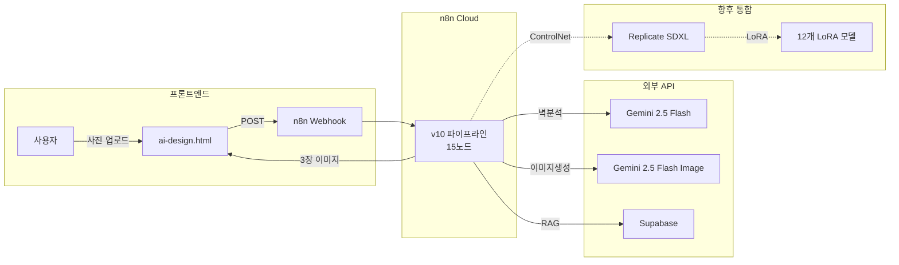
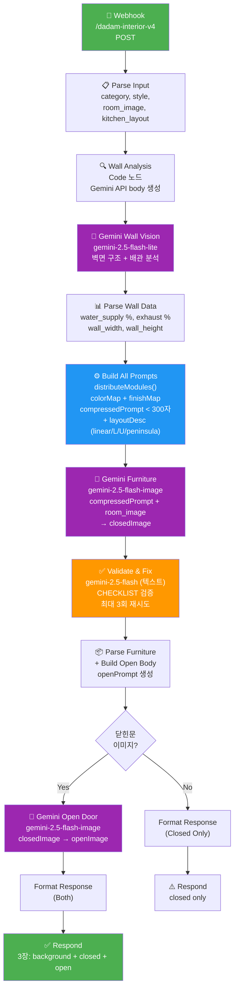
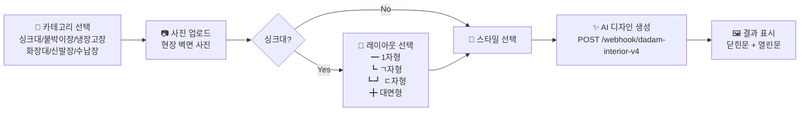
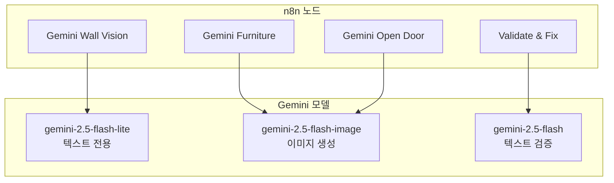
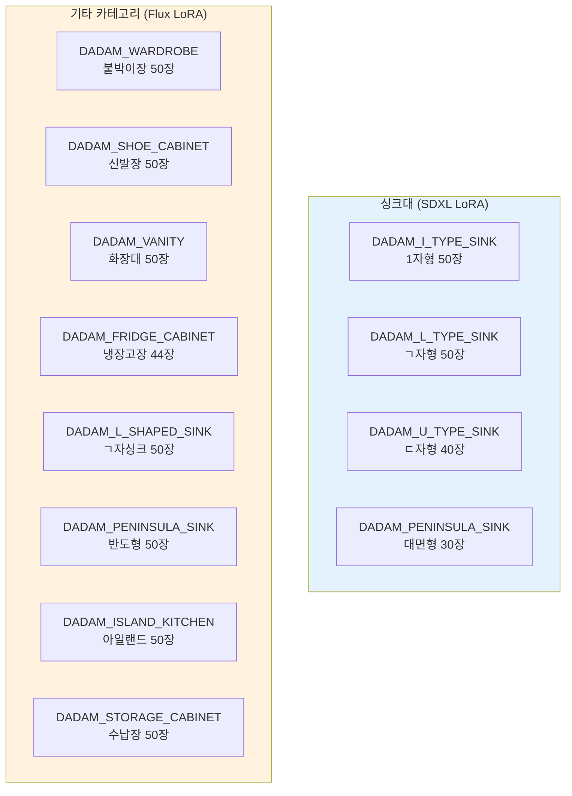
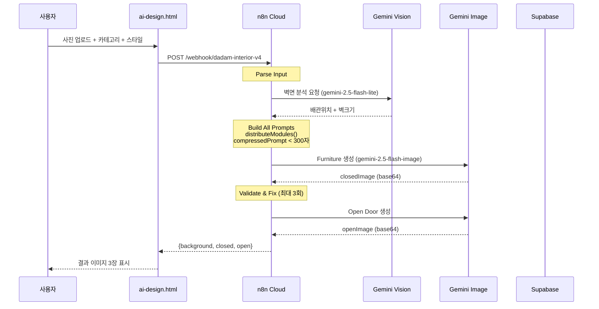

# 다담AI 프로덕션 파이프라인 시각화

## 1. 전체 시스템 아키텍처



## 2. n8n v10 파이프라인 상세



## 3. 프론트엔드 사용자 플로우



## 4. Gemini 모델 매핑



## 5. LoRA 모델 현황



## 6. 데이터 플로우 (API 요청 → 응답)



---

## Claude 채팅용 복사 텍스트

아래 텍스트를 Claude 채팅에 붙여넣으면 전체 시스템을 이해할 수 있습니다:

```
다담AI 프로덕션 시스템 요약:

[아키텍처]
- 프론트엔드: ai-design.html (정적 HTML)
- 백엔드: n8n Cloud (워크플로우 자동화)
- AI: Gemini API (벽분석 + 이미지 생성)
- DB: Supabase (PostgreSQL + Vector + Storage)
- LoRA: Replicate (12개 가구 카테고리 학습 완료)

[n8n v10 파이프라인 - 15노드]
Webhook → Parse Input → Wall Analysis → Gemini Wall Vision(gemini-2.5-flash-lite)
→ Parse Wall Data → Build All Prompts(distributeModules, compressedPrompt<300자)
→ Gemini Furniture(gemini-2.5-flash-image) → Validate & Fix(최대 3회)
→ Parse Furniture → Has Closed? → Gemini Open Door → Format Response → Respond

[입력] room_image(base64), category, kitchen_layout, design_style
[출력] generated_image: { background, closed, open } (각 base64)

[주방 레이아웃]
- i_type: 1자형 (직선형)
- l_type: ㄱ자형 (L자형)
- u_type: ㄷ자형 (U자형)
- peninsula: 대면형 (11자형)

[Gemini 모델]
- gemini-2.5-flash-lite: 벽 분석 (텍스트+비전)
- gemini-2.5-flash-image: 이미지 생성 (Furniture + Open Door)
- gemini-2.5-flash: 검증 (Validate & Fix)

[LoRA 모델 - Replicate]
싱크대 4종(SDXL): i_type/l_type/u_type/peninsula
기타 8종(Flux): wardrobe/shoe/vanity/fridge/l_shaped/peninsula/island/storage
```
